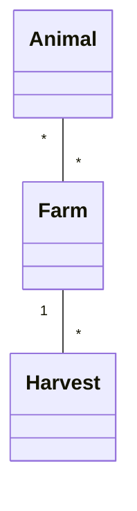
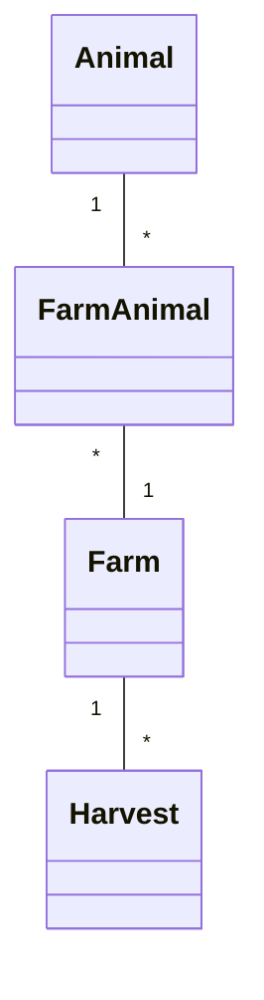

# FarmManagement - Project .NET Framework

- Naam: Matthias Wuyts
- Studentennummer: 0175026-38
- Academiejaar: 25-26
- Klasgroep: ISB204A
- Onderwerp: Animal \* - \* Farm 1 - \* Harvest

## Sprint 1



## Sprint 3

### Beide zoekcriteria ingevuld
```sql
SELECT "a"."Id", "a"."AverageWeight", "a"."Lifespan", "a"."Species", "a"."Type"
FROM "Animals" AS "a"
WHERE "a"."Type" = @__type_0 AND "a"."Lifespan" >= @__minimumLifespan_1
```
### Enkel zoeken op type dier
```sql
SELECT "a"."Id", "a"."AverageWeight", "a"."Lifespan", "a"."Species", "a"."Type"
FROM "Animals" AS "a"
WHERE "a"."Type" = @__type_0
```
### Enkel zoeken op minimum lifespan
```sql
SELECT "a"."Id", "a"."AverageWeight", "a"."Lifespan", "a"."Species", "a"."Type"
FROM "Animals" AS "a"
WHERE "a"."Lifespan" >= @__minimumLifespan_0
```
### Beide zoekcriteria leeg
```sql
SELECT "a"."Id", "a"."AverageWeight", "a"."Lifespan", "a"."Species", "a"."Type"
FROM "Animals" AS "a"
```

## Sprint 4



## Sprint 6

### Nieuwe Harvest
#### Request
```http request
POST https://localhost:7214/api/Harvests
Content-Type: application/json

{
  "cropType": "Corn",
  "quantity": 500.10,
  "harvestDate": "2025-09-01"
}
```
#### Response
```http request
HTTP/2 201 Created
content-type: application/json; charset=utf-8
date: Sat, 20 Dec 2025 21:19:42 GMT
server: Kestrel
location: https://localhost:7214/api/Harvests?id=17
x-http2-stream-id: 3
transfer-encoding: chunked

{
  "id": 17,
  "cropType": "Corn",
  "harvestDate": "2025-09-01",
  "quantity": 500.1,
  "farm": null
}
Response file saved.
> 2025-12-20T221942.201.json

Response code: 201 (Created); Time: 51ms (51 ms); Content length: 83 bytes (83 B)
```

## Sprint 7
### Testgebruikers & Rollen

| E-mail          | Wachtwoord | Rol |
|:----------------|:-----------| :--- |
| **lars@kdg.be** | Password1! | `Admin` |
| **anna@kdg.be** | Password1! | `Admin` |
| **bob@kdg.be**  | Password1! | `User` |
| **chef@kdg.be** | Password1! | `User` |
| **test@kdg.be** | Password1! | `User` |

### Nieuwe Harvest (niet aangemeld)
#### Request
```http request
POST https://localhost:7214/api/Harvests
Content-Type: application/json

{
"cropType": "Corn",
"quantity": 500.10,
"harvestDate": "2025-09-01"
}
```
#### Response
```http request
HTTP/2 401 Unauthorized
location: https://localhost:7214/Identity/Account/Login?ReturnUrl=%2Fapi%2FHarvests
```

### Nieuwe Harvest (aangemeld)
#### Request
```http request
POST https://localhost:7214/api/Harvests
Content-Type: application/json
Cookie: .AspNetCore.Identity.Application=CfDJ8J6kXnQBMyxPiGWCYMmdsYrcQI2K325p2cAd6IuGiTnfXvfZPUTSOffwW8qk_UMVF_T8enTejfaGYbsg3mICYH-9G78P4hX2bUdzJkvJQTtHgGrBht5E1kKOuKyPb3ikzktzVqCnHfcCUxvkaoIl_jlNUU3sadWAe7vkf2B2pqKMACKH27mGBsLH3LSDhynqveA_3TIrF30ePlVFTZTJV-PKIgxB70nOyy1R0h4JgJTnxXBeysBlIUW8lcZlaTaC6Fs7F6SfWnMXebV76Zu34u8kNz1SErwztmDEWsiq3YBaYM44Lj87Zrkhxx8nAv_FDCmngXtnBP5wzONHFxSEVLsUb69p-PiHTwSSlYSmLMh8J1ULELowkd0hJxaddIT-V7YvKoElR-SU0SOe2mVWOIB-ddR5hUl6jl4KwM1U0DTFkwnn4wt_deYFkJxF15nogN-PHxdUfz0D02BOJnNRbVRAtcpU-htWrak_CPp0-B_dyavc3JUIba5p04lIKLzJLPsx5aR66AHuMnRdLq_YKyEUnDVSxR0MHUUWuMdn6mRWGK9yyszo6zGJNdny5L0H7-aJeQk8ZyowfEyquJWk_egdLjlYWWOgqtIvIBVFVhV3AX4gHCKLcit3W4Q5qOEIt-hYuAhBHahJtUuhRoB-71TeiPorHmLsdTjYjJO_ntB-xPVvRODV1pTfa1Id7vXH9K3EjpKsbXzQHwDReHp15y2kTmZu489JjNIzISK2_aKkftOSsMyg0q3Ma2NRaV9QIvYb2JBdPVjheSz2Wv83gUnKZL4Kjzjz4oM-Qi8Td5EIJ-jeufVMeXl7c7pPPIeiag

{
  "cropType": "Corn",
  "quantity": 500.10,
  "harvestDate": "2025-09-01"
}
```
#### Response
```http request
HTTP/2 201 Created
location: https://localhost:7214/api/Harvests/19

{
  "id": 19,
  "cropType": "Corn",
  "harvestDate": "2025-09-01",
  "quantity": 500.1,
  "farm": null
}

```